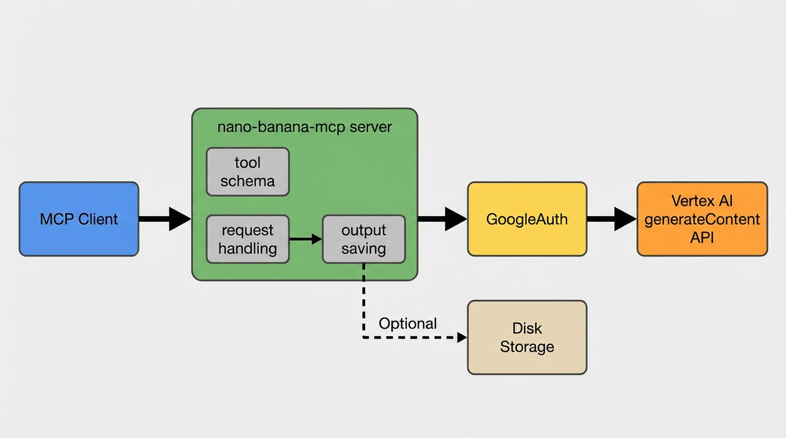

# nano-banana-mcp



MCP server that generates images with Gemini 3 Pro Image on Vertex AI.

## Requirements

- Node.js 18+
- Vertex AI API enabled in your GCP project
- A service account with permission to call Vertex AI

## Setup

```bash
npm install
```

Create a `.env` file or export the variables directly:

```bash
export GOOGLE_SERVICE_ACCOUNT_JSON='{"type":"service_account","project_id":"your-project","private_key":"...","client_email":"..."}'
# or point to a JSON file
export GOOGLE_SERVICE_ACCOUNT_JSON=/absolute/path/to/service-account.json

export VERTEX_PROJECT_ID=your-project
export VERTEX_LOCATION=global
export NANO_BANANA_MODEL=gemini-3-pro-image-preview
export NANO_BANANA_GCS_BUCKET=your-reference-bucket
export NANO_BANANA_GCS_PREFIX=nano-banana/refs
export NANO_BANANA_OUTPUT_GCS_BUCKET=your-output-bucket
export NANO_BANANA_OUTPUT_GCS_PREFIX=nano-banana/outputs
export NANO_BANANA_OUTPUT_DIR=~/nano-banana-outputs
export NANO_BANANA_PROGRESS_INTERVAL_MS=20000
export NANO_BANANA_AUTO_TASK_4K=false
export NANO_BANANA_AUTO_TASK_TTL_MS=1200000
```

Notes:
- `GOOGLE_SERVICE_ACCOUNT_JSON` is required (JSON string or file path).
- `VERTEX_PROJECT_ID` is optional if the service account JSON includes `project_id`.
- The default model is `gemini-3-pro-image-preview` (Vertex preview). Override with another model ID if needed.
- `NANO_BANANA_GCS_BUCKET` is required if you want the server to upload local reference images to GCS.
- `NANO_BANANA_GCS_PREFIX` controls the object prefix for uploaded reference images (default: `nano-banana/refs`).
- `NANO_BANANA_OUTPUT_GCS_BUCKET` controls the GCS bucket for generated images (defaults to `NANO_BANANA_GCS_BUCKET`).
- `NANO_BANANA_OUTPUT_GCS_PREFIX` controls the object prefix for generated images (default: `nano-banana/outputs`).
- `NANO_BANANA_OUTPUT_DIR` sets the local save root (defaults to `~/nano-banana-outputs`). Relative `outputDir` values resolve under this path.
- `NANO_BANANA_PROGRESS_INTERVAL_MS` controls how often progress notifications are emitted (ms) to keep long MCP calls alive. Set `0` to disable.
- `NANO_BANANA_AUTO_TASK_4K` runs 4K generations in task mode automatically to avoid client timeouts (set `true` to enable).
- `NANO_BANANA_AUTO_TASK_TTL_MS` controls how long auto-task results remain available (ms). Set `0` for no expiry.
- If you use GCS `fileUri` references, grant `Storage Object Viewer` to the Vertex AI service agent for the bucket.
- If you use `referenceImagePaths`, the MCP service account needs `Storage Object Creator` (or broader) on the bucket.
- For generated image uploads, the MCP service account needs `Storage Object Creator` (or broader) on the output bucket.
- If you see a 404 error with `global`, try a supported region like `us-central1` or `europe-west4`.

## Run

```bash
npm run dev
```

If you run via `dist/` (e.g. `npm start` or an MCP config that points to `dist/index.js`), run `npm run build` after code changes.

## Long-running calls

If your MCP client enforces the 60s default timeout, use progress notifications or task mode.

4K generations can be auto-run in task mode to avoid timeouts. Enable with `NANO_BANANA_AUTO_TASK_4K=true` if your client supports tasks.
If your client does not support MCP tasks, auto-tasking returns a polling task ID via the normal tool response; call `nano_banana_get_task` to check status and retrieve the final result.

Progress (keeps a single request alive by resetting the timeout):

```ts
import { Client } from "@modelcontextprotocol/sdk/client/index.js";
import { StdioClientTransport } from "@modelcontextprotocol/sdk/client/stdio.js";
import { CallToolResultSchema } from "@modelcontextprotocol/sdk/types.js";

const client = new Client(
  { name: "example-client", version: "0.1.0" },
  { capabilities: {} }
);

await client.connect(
  new StdioClientTransport({ command: "nano-banana-mcp" })
);

const result = await client.request(
  {
    method: "tools/call",
    params: {
      name: "nano_banana_generate_image",
      arguments: {
        prompt: "A cinematic landscape at golden hour",
        aspectRatio: "16:9",
      },
    },
  },
  CallToolResultSchema,
  {
    onprogress: (progress) => {
      console.log(progress.message ?? progress.progress);
    },
    resetTimeoutOnProgress: true,
  }
);
```

Tasks (returns immediately, then poll/stream the result):

```ts
const stream = client.experimental.tasks.callToolStream(
  {
    name: "nano_banana_generate_image",
    arguments: {
      prompt: "A cinematic landscape at golden hour",
      aspectRatio: "16:9",
    },
  },
  CallToolResultSchema,
  {
    task: {
      ttl: 15 * 60 * 1000,
      pollInterval: 1000,
    },
  }
);

for await (const message of stream) {
  if (message.type === "taskStatus") {
    console.log(message.task.status, message.task.statusMessage ?? "");
  }
  if (message.type === "result") {
    console.log(message.result);
  }
}
```

Notes:
- Task state is stored in memory; tasks are lost when the server restarts.
- Task mode still benefits from progress notifications if the client subscribes.

Polling fallback (for clients without MCP task support):

```ts
const start = await client.request(
  {
    method: "tools/call",
    params: {
      name: "nano_banana_generate_image",
      arguments: {
        prompt: "A cinematic landscape at golden hour",
        imageSize: "4K",
        aspectRatio: "16:9",
      },
    },
  },
  CallToolResultSchema
);

// extract taskId from start.structuredContent or the text response
const poll = await client.request(
  {
    method: "tools/call",
    params: {
      name: "nano_banana_get_task",
      arguments: { taskId: "<taskId>" },
    },
  },
  CallToolResultSchema
);
```

Notes:
- Polling tasks are stored in memory and are cleared on server restart.
- Polling tasks expire after `NANO_BANANA_AUTO_TASK_TTL_MS` (set `0` to disable expiry).
- Completed polling responses include `structuredContent` with `outputImageUris`, `outputImageUrls`, and `savedPaths` when available.
- Wait a few seconds between `nano_banana_get_task` polls to avoid hammering the server.

## MCP tool

Tool name: `nano_banana_generate_image`
Tool name: `nano_banana_get_task` (polling fallback for auto-task 4K requests)

Example arguments:

```json
{
  "prompt": "A cozy ramen shop on a rainy night, cinematic lighting",
  "aspectRatio": "16:9",
  "includeText": false
}
```

Responses include GCS URIs (and HTTP URLs) for generated images; image bytes are uploaded to GCS to avoid large MCP payloads.
Generated images are also saved locally under `NANO_BANANA_OUTPUT_DIR` (or `outputDir`).

Optional fields:
- `referenceImages`: array of `{ "mimeType": "image/png", "data": "<base64>" }` (legacy; prefer URIs or local paths)
- `referenceImageUris`: array of `{ "mimeType": "image/png", "fileUri": "gs://bucket/path.png" }`
- `referenceImagePaths`: array of `{ "path": "/abs/path.png", "mimeType": "image/png" }` (uploads to GCS)
- `responseModalities`: `["IMAGE"]` or `["TEXT", "IMAGE"]`
- `candidateCount`: integer 1-8
- `imageSize`: `1K`, `2K`, `4K` (for models that support it)
- `model`, `location`, `projectId`: overrides
- `gcsBucket`: override the GCS bucket for uploads
- `gcsUploadPrefix`: override the GCS object prefix for uploads
- `outputGcsBucket`: override the GCS bucket for generated image uploads
- `outputGcsPrefix`: override the GCS object prefix for generated image uploads
- `outputDir`: directory to save generated images on disk (relative paths resolve under `NANO_BANANA_OUTPUT_DIR`)
- `outputFilePrefix`: filename prefix used when saving images and naming GCS objects

Example with a GCS reference image:

```json
{
  "prompt": "Use the reference image for style, generate a new scene.",
  "referenceImageUris": [
    {
      "mimeType": "image/png",
      "fileUri": "gs://my-bucket/reference.png"
    }
  ]
}
```

Example uploading a local image and using it as a reference:

```json
{
  "prompt": "Transform this into an isometric game scene.",
  "referenceImagePaths": [
    {
      "path": "/absolute/path/to/reference.jpg"
    }
  ]
}
```

## References

- Gemini 3 Pro Image model card: https://docs.cloud.google.com/vertex-ai/generative-ai/docs/models/gemini/3-pro-image
- Gemini image generation docs (model IDs, response format): https://ai.google.dev/gemini-api/docs/image-generation
